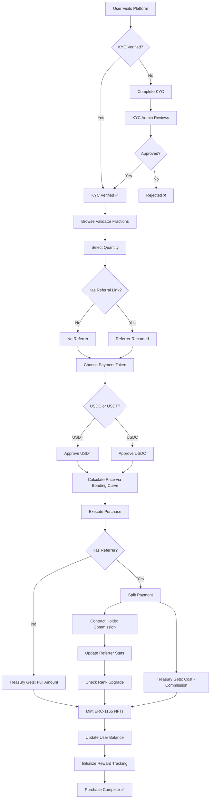
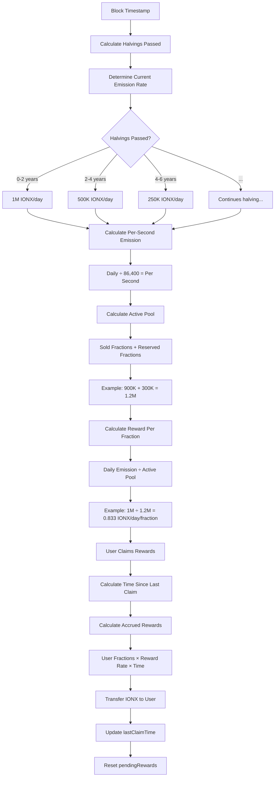
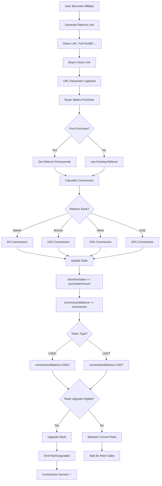
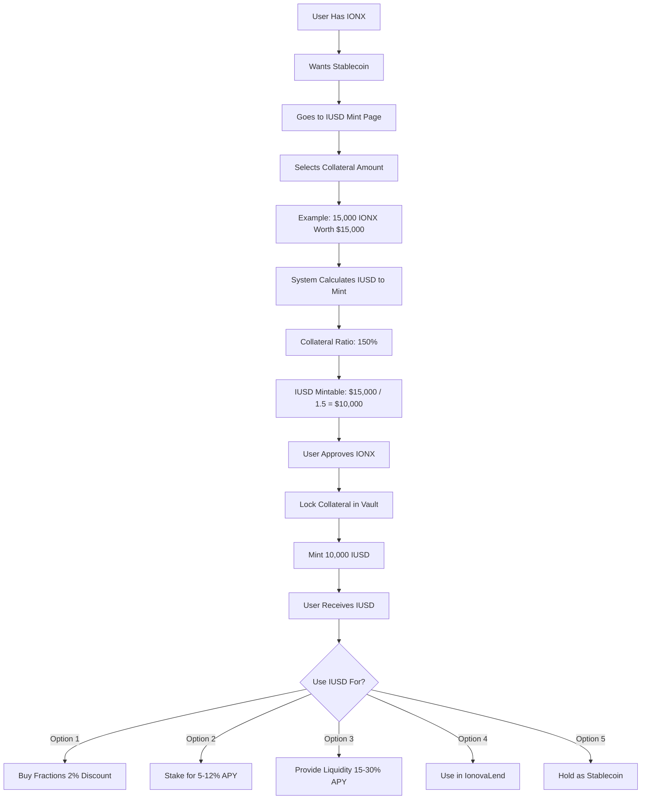
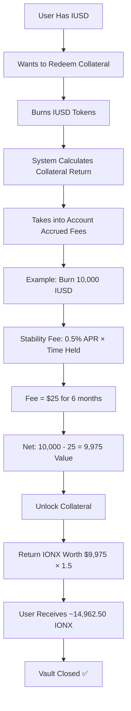
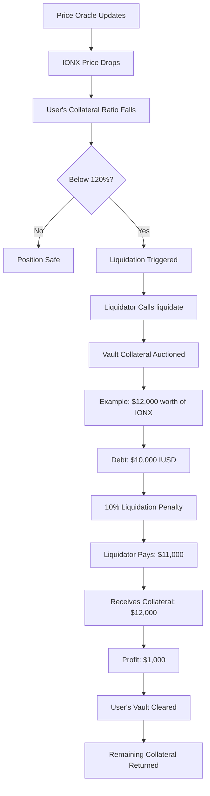
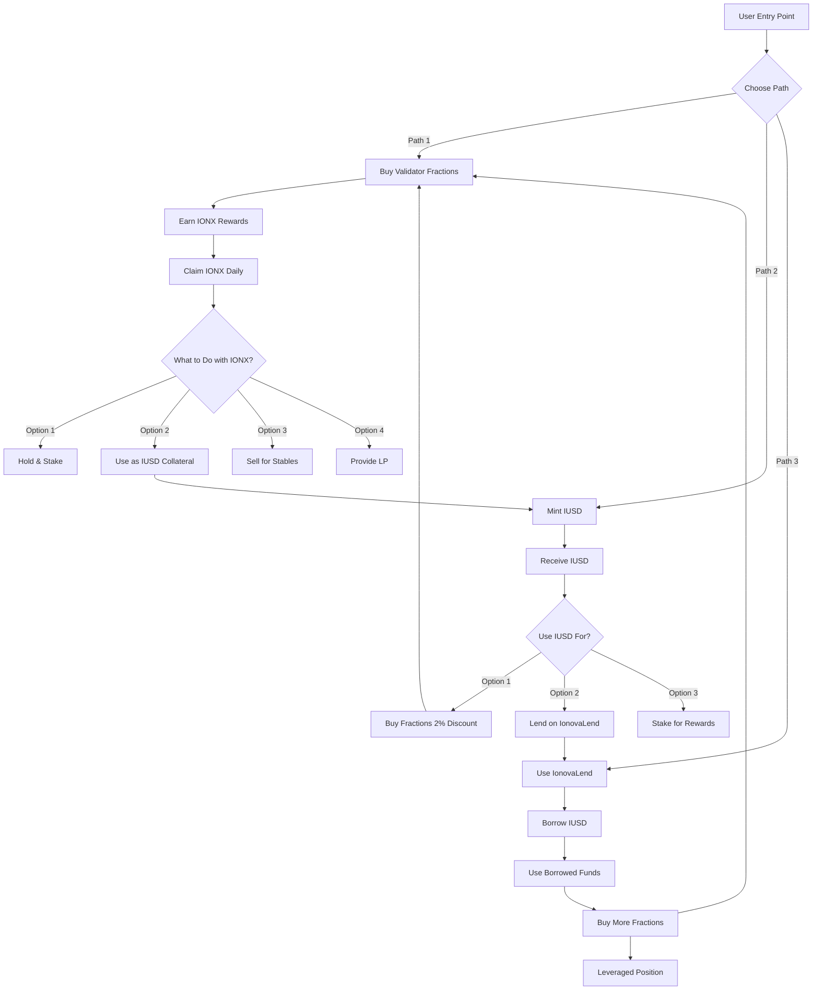
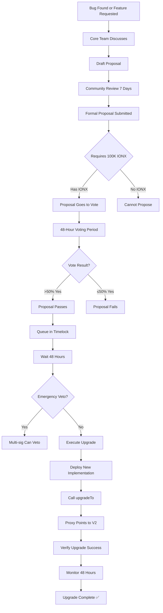

# 🔄 Ionova Complete Workflow Documentation

## Table of Contents
1. [Validator Fraction Purchase Flow](#1-validator-fraction-purchase-flow)
2. [IONX Rewards Distribution Flow](#2-ionx-rewards-distribution-flow)
3. [Affiliate Commission Flow](#3-affiliate-commission-flow)
4. [IUSD Stablecoin Flow](#4-iusd-stablecoin-flow)
5. [Cross-Protocol Integration](#5-cross-protocol-integration)
6. [Upgrade & Governance Flow](#6-upgrade--governance-flow)

---

## 1. Validator Fraction Purchase Flow

### **Complete User Journey:**



### **Step-by-Step Breakdown:**

#### **Phase 1: Pre-Purchase**
```
1. User connects wallet (MetaMask, WalletConnect, etc.)
2. System checks KYC status
   ├─ If not verified → Redirect to KYC
   └─ If verified → Proceed

3. User browses available fractions
   - View current price (bonding curve)
   - See remaining supply
   - Check ROI calculator
```

#### **Phase 2: Token Selection**
```
4. User selects payment token
   ┌─ USDC (most common)
   ├─ USDT (alternative)
   └─ IUSD (future - 2% discount)

5. User approves spending
   - First-time: Infinite approval
   - Subsequent: Uses existing approval
```

#### **Phase 3: Price Calculation**
```
6. Smart contract calculates cost
   
   Formula:
   for i = 1 to quantity:
       fractionNumber = fractionsSold + i
       price[i] = START_PRICE + (fractionNumber × PRICE_RANGE / TOTAL_FRACTIONS)
       totalCost += price[i]
   
   Example (buying 1,000 fractions at position 100,000):
   - Fraction #100,001 = $10 + (100,001 × $90 / 1,800,000) = $15.00
   - Fraction #100,002 = $15.00 + ...
   - ...
   - Fraction #101,000 = $15.05
   - Total Cost ≈ $15,025
```

#### **Phase 4: Commission Calculation (if referred)**
```
7. Check referrer rank
   ├─ Starter (0-$1K): 5% commission
   ├─ Bronze ($1K-$10K): 10% commission
   ├─ Silver ($10K-$100K): 15% commission
   └─ Gold ($100K+): 20% commission

8. Calculate commission
   commission = totalCost × (rank.commissionRate / 10000)
   
   Example:
   - Total Cost: $15,025
   - Referrer Rank: Bronze (10%)
   - Commission: $1,502.50
   
9. Update referrer stats
   - downlineSales += $15,025
   - selfSales (if buying own) += $15,025
   - commissionBalance[USDC] += $1,502.50
   
10. Check for rank upgrade
    if (downlineSales >= nextRank.threshold && selfSales >= nextRank.selfThreshold):
        upgrade rank
        emit RankUpgraded event
```

#### **Phase 5: Payment Distribution**
```
11. Transfer tokens
    
    With Referrer:
    ├─ User → Treasury: $13,522.50 (cost - commission)
    └─ User → Contract: $1,502.50 (commission held for claim)
    
    Without Referrer:
    └─ User → Treasury: $15,025 (full amount)
```

#### **Phase 6: NFT Minting**
```
12. Mint ERC-1155 NFTs
    
    for i = 1 to quantity:
        tokenId = fractionsSold + i
        _mint(buyer, tokenId, 1, "")
        lastClaimTime[tokenId] = block.timestamp
    
    fractionsSold += quantity
    totalFractionsOwned[buyer] += quantity
```

#### **Phase 7: Post-Purchase**
```
13. User receives:
    - 1,000 ERC-1155 NFT fractions
    - Tradeable on OpenSea
    - Earning IONX rewards immediately
    
14. System updates:
    - Global fractionsSold counter
    - User's fraction balance
    - Bonding curve price
    - Reward eligibility
```

---

## 2. IONX Rewards Distribution Flow

### **Emission & Distribution:**



### **Reward Calculation Example:**

```javascript
// User with 1,000 fractions, claims after 7 days

1. Current emission: 1,000,000 IONX/day (Year 1)
2. Active pool: 1,200,000 fractions
3. Reward per fraction: 1,000,000 / 1,200,000 = 0.833 IONX/day
4. User's daily rate: 1,000 × 0.833 = 833 IONX/day
5. Time elapsed: 7 days
6. Total reward: 833 × 7 = 5,831 IONX

User receives 5,831 IONX tokens ✅
```

### **Real-Time Accrual:**

```
Every second:
├─ Emission per second = Daily Emission / 86,400
├─ User's share = (User Fractions / Active Pool) × Emission per second
└─ Pending rewards increase automatically

Example (1,000 fractions at Year 1):
- Per second: 11.574 IONX/sec (network total)
- Active pool: 1,200,000
- User's share: (1,000 / 1,200,000) × 11.574 = 0.00965 IONX/sec
- Per minute: 0.579 IONX
- Per hour: 34.7 IONX
- Per day: 833 IONX
```

---

## 3. Affiliate Commission Flow

### **Complete Affiliate Journey:**



### **Rank Progression:**

```
Starter Rank (Default):
├─ Requirements: None
├─ Commission: 5%
├─ Example: $1,000 sale = $50 commission
└─ Next: Reach $1,000 downline + $100 self

         ↓

Bronze Rank:
├─ Requirements: $1,000 downline + $100 self
├─ Commission: 10%
├─ Example: $1,000 sale = $100 commission  
└─ Next: Reach $10,000 downline + $1,000 self

         ↓

Silver Rank:
├─ Requirements: $10,000 downline + $1,000 self
├─ Commission: 15%
├─ Example: $1,000 sale = $150 commission
└─ Next: Reach $100,000 downline + $5,000 self

         ↓

Gold Rank (Maximum):
├─ Requirements: $100,000 downline + $5,000 self
├─ Commission: 20%
├─ Example: $1,000 sale = $200 commission
└─ No further ranks
```

### **Commission Claim Process:**

```
1. Affiliate views dashboard
   ├─ Pending USDC commission: $1,234.56
   ├─ Pending USDT commission: $567.89
   └─ Total pending: $1,802.45

2. Affiliate chooses claim method:
   
   Option A: Claim specific token
   ├─ Click "Claim USDC" → Receives $1,234.56 USDC
   └─ Click "Claim USDT" → Receives $567.89 USDT
   
   Option B: Claim all tokens
   └─ Click "Claim All" → Receives both in one transaction

3. Smart contract execution:
   ├─ Reset commissionBalance[user][token] = 0
   ├─ Update totalCommissionsPaid
   ├─ Transfer tokens to user
   └─ Emit CommissionClaimed event

4. Affiliate receives funds ✅
```

---

## 4. IUSD Stablecoin Flow

### **Minting IUSD:**



### **Burning IUSD (Redeem Collateral):**



### **Liquidation Flow:**



---

## 5. Cross-Protocol Integration

### **Complete Ecosystem Flow:**



### **Flywheel Effect:**

```
User Journey Example:

Day 1:
├─ Buy 10,000 fractions for $150,000
└─ Start earning 9,700 IONX/day

Day 30:
├─ Accumulated 291,000 IONX (worth ~$291,000)
├─ Mint 200,000 IUSD (using IONX as 150% collateral)
└─ Stake IUSD for 8% APY

Day 60:
├─ IUSD staking earned 2,630 IUSD
├─ Use 100,000 IUSD to buy more fractions (+2% discount)
├─ Now own 12,000 fractions total
└─ Earning 11,640 IONX/day

Day 90:
├─ Affiliate program paid $5,000 in commissions
├─ Used commissions to buy 50 more fractions
├─ Total fractions: 12,050
├─ IONX per day: 11,688.5
└─ Compounding growth continues...
```

---

## 6. Upgrade & Governance Flow

### **Contract Upgrade Process:**



### **Voting Power Calculation:**

```
Voting Power Sources:

1. IONX Tokens:
   └─ 1 IONX = 1 vote

2. Validator Fraction NFTs:
   └─ 1 Fraction = 100 votes

3. IUSD Stablecoin:
   └─ 1 IUSD = 0.5 votes

Example User:
├─ 50,000 IONX = 50,000 votes
├─ 1,000 Fractions = 100,000 votes
├─ 10,000 IUSD = 5,000 votes
└─ Total Voting Power = 155,000 votes

Proposal Thresholds:
├─ Quorum: 10% of circulating supply
├─ Approval: >50% of votes cast
└─ Veto: Multi-sig can veto within 24 hours (emergency only)
```

---

## 📊 Complete System Architecture

```
┌─────────────────────────────────────────────────────────────────┐
│                    IONOVA ECOSYSTEM LAYERS                       │
└─────────────────────────────────────────────────────────────────┘

Layer 1: USER INTERFACE
├─ Website (React + Next.js)
├─ Wallet Connection (MetaMask, WalletConnect)
├─ Dashboard (Holdings, Rewards, Affiliates)
└─ Mobile App (Future)

Layer 2: SMART CONTRACTS (Upgradeable)
├─ ValidatorFractionNFT.sol (UUPS Proxy)
│   ├─ Bonding curve pricing
│   ├─ ERC-1155 NFT minting
│   ├─ Multi-token payments (USDC, USDT)
│   ├─ Affiliate commission tracking
│   └─ IONX reward distribution
│
├─ IUSD.sol (UUPS Proxy)
│   ├─ Collateral vaults
│   ├─ Peg stability module (PSM)
│   ├─ Over-collateralization (150%)
│   └─ Liquidation system
│
├─ IonovaLend.sol (UUPS Proxy)
│   ├─ Lending pools
│   ├─ Interest rate models
│   ├─ Collateral management
│   └─ Liquidation engine
│
└─ IONX.sol (UUPS Proxy)
    ├─ Emission with halving
    ├─ Staking mechanisms
    ├─ Governance voting
    └─ Fee distribution

Layer 3: ORACLES & DATA
├─ Chainlink Price Feeds
├─ IONX/USD oracle
├─ Validator performance metrics
└─ Network statistics

Layer 4: INFRASTRUCTURE
├─ Ethereum Mainnet
├─ Layer 2 (Arbitrum, Optimism)
├─ IPFS (Metadata storage)
└─ TheGraph (Indexing)

Layer 5: GOVERNANCE
├─ Multi-sig Wallet (3 of 5)
├─ Timelock Controller (48 hours)
├─ DAO Governance (Community voting)
└─ Emergency Pause Mechanisms
```

---

## 🎯 Key Metrics & KPIs

### **Protocol Health:**
```
1. Total Value Locked (TVL)
   ├─ Validator fractions sold
   ├─ IUSD collateral locked
   └─ IonovaLend deposits

2. Daily Active Users (DAU)
   ├─ Unique wallet addresses
   ├─ Transaction count
   └─ Reward claims

3. Revenue Metrics
   ├─ Fraction sales (to treasury)
   ├─ Stability fees (IUSD)
   ├─ Lending interest
   └─ Liquidation penalties

4. IONX Distribution
   ├─ Total minted to date
   ├─ Daily emission rate
   ├─ Next halving countdown
   └─ Holder distribution
```

---

## ✅ Complete Workflow Summary

**Purchase → Earn → Compound → Govern**

1. **User buys validator fractions** (with optional referral)
2. **Earns IONX rewards** (halving every 2 years)
3. **Uses IONX to mint IUSD** (stablecoin with utility)
4. **Stakes IUSD or lends** (additional yield)
5. **Compounds earnings** (buy more fractions)
6. **Participates in governance** (vote on upgrades)
7. **Entire ecosystem grows** 🚀

**This creates a self-sustaining, composable DeFi ecosystem!**
