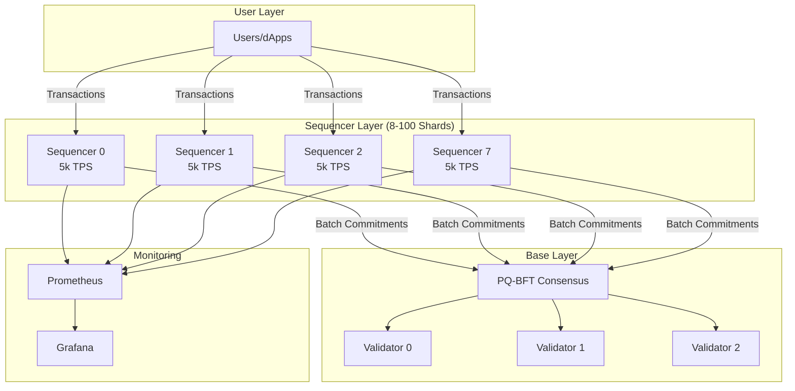

# Ionova Architecture

## Overview

Ionova is a **sharded, rollup-first blockchain** designed to achieve 500,000+ TPS with minimal transaction fees through horizontal scaling and efficient batching.

## Core Design Principles

1. **Horizontal Scaling**: Multiple parallel execution units (shards)
2. **Batching**: Sequencers batch transactions off-chain, post compact commitments on-chain
3. **Light Consensus**: Base layer finalizes batch commitments, not individual transactions
4. **Post-Quantum Security**: PQ-signed checkpoints for long-term security

## System Architecture



## Throughput Scaling

### Capacity Planning

Target: **500,000 TPS**

Per-shard sustainable TPS: **5,000 TPS**

Required shards:
```
500,000 ÷ 5,000 = 100 shards
```

### Devnet Configuration (Phase 1)

- **8 shards** → 40,000 TPS total
- **3 validators** → Committee consensus
- **Block time**: 1 second

### Production Scaling (Phase 2+)

- **100 shards** → 500,000 TPS total
- **~21 validators** → Decentralized consensus
- **Block time**: 1 second

## Layered Architecture

### 1. User Layer
- Wallets and dApps submit transactions
- Load balanced across shards
- Account addresses determine shard assignment (consistent hashing)

### 2. Sequencer Layer
Each shard has a dedicated sequencer that:
- **Collects** transactions from mempool
- **Orders** them deterministically
- **Batches** into micro-blocks (200ms intervals)
- **Produces** batch commitments (1s intervals)
- **Submits** to base layer

#### Micro-block Flow
```
[Tx Queue] → [Micro-block 1] → [Micro-block 2] → ... → [Micro-block 5]
                                                              ↓
                                                      [Batch Commitment]
                                                              ↓
                                                        [Base Layer]
```

### 3. Base Layer (Validators)
- **Consensus**: PQ-BFT (Byzantine Fault Tolerant with Post-Quantum signatures)
- **Validates**: Batch commitments (not individual txs)
- **Finalizes**: State roots with PQ checkpoints
- **Stores**: Compact proofs and merkle roots

### Gas and Execution

### Gas Model
- **Per-tx gas limit**: 50,000 (configurable)
- **Per-block gas limit**: 25,000,000 per shard
- **Target utilization**: 80% (20M gas)

### Dual VM Support

Ionova supports **two execution environments**:

```
┌─────────────────────────────────┐
│   Smart Contract Execution      │
├─────────────────┬───────────────┤
│   EVM Layer     │  WASM Layer   │
│   (Solidity)    │  (Rust)       │
├─────────────────┴───────────────┤
│      Sequencer Runtime          │
└─────────────────────────────────┘
```

#### 1. EVM (Ethereum Virtual Machine)
- **Language**: Solidity, Vyper
- **Use case**: Port existing Ethereum dApps
- **Tools**: Hardhat, Foundry, Remix
- **Address format**: `0x...` (20 bytes)
- **Gas model**: Same as Ethereum

**Example Solidity contract:**
```solidity
contract SimpleStorage {
    uint256 value;
    function setValue(uint256 _value) public {
        value = _value;
    }
}
```

#### 2. WASM (WebAssembly)
- **Language**: Rust, AssemblyScript
- **Use case**: High-performance, native contracts
- **Address format**: `ionova1...` (bech32)
- **Advantages**: Lower gas costs, better performance

**Why dual VM?**
- ✅ Ethereum compatibility → Instant ecosystem
- ✅ Performance when needed → WASM for intensive tasks
- ✅ Developer choice → Use familiar tools

### Parallel Execution
- Each shard executes independently
- EVM and WASM contracts can coexist
- Deterministic execution for reproducibility
- Cross-VM calls via bridge contracts

## Cross-Shard Communication

### Asynchronous Message Passing
```
Shard A                    Shard B
   |                          |
   |-- Send Receipt --------->|
   |                          |
   |<------ Acknowledgment ---|
```

### Two-Phase Commits (Optional)
For atomic cross-shard transactions:
1. **Prepare**: Lock state on both shards
2. **Commit**: Execute atomically or rollback

## State Management

### Verkle Tries
- **Compact proofs**: Smaller than Merkle trees
- **Stateless validation**: Validators don't need full state
- **Efficient updates**: Per-shard state trees

### State Pruning
- Archive nodes: Full history
- Full nodes: Recent state + checkpoints
- Light clients: Proofs only

## Networking

### P2P Layer
- **Gossipsub**: Efficient message propagation
- **Per-shard subnets**: Reduce bandwidth
- **Binary encoding**: Protobuf/Snappy compression

### Performance Requirements
- **Sequencers**: 100 Gbps NIC, 64 vCPU, 256GB RAM
- **Validators**: 25 Gbps NIC, 32 vCPU, 128GB RAM
- **Latency**: Sub-millisecond between sequencer and validators

## Security Model

### Post-Quantum Checkpoints
- **Algorithm**: Dilithium (NIST PQ finalist)
- **Frequency**: Every N blocks (configurable)
- **Purpose**: Protect against future quantum attacks

### Byzantine Fault Tolerance
- **Threshold**: 67% honest validators (2/3 + 1)
- **Slashing**: Validators lose stake for misbehavior
- **Finality**: 1-2 blocks (1-2 seconds)

### Economic Security
- **Staking**: Validators must stake IONX
- **Slashing conditions**:
  - Double-signing
  - Censoring valid transactions
  - Producing invalid batches

## Fee Economics

See [FEE_MODEL.md](file:///f:/ionova/requirements/FEE_MODEL.md) for details.

**Summary**:
- Base fee: 0.0001 IONX (anti-spam)
- Gas fee: ~0.000001 IONX per gas (dynamic)
- Average tx: ~0.0051 IONX

## Monitoring & Telemetry

### Metrics Collected
- Per-shard TPS
- Transaction latency (p50, p95, p99)
- Mempool depth
- Block utilization
- Network bandwidth
- CPU/memory usage

### Dashboards
- Grafana for real-time visualization
- Prometheus for metrics storage
- Alert rules for anomalies

## Governance

### On-Chain Parameters
- `base_tx_fee`
- `base_fee_per_gas`
- `shard_count` (expansion only)
- `block_time`
- `gas_limits`

### Proposal Process
1. Submit on-chain proposal
2. Community discussion
3. Voting period (7 days)
4. Timelock (48 hours)
5. Execution

## Roadmap

### Phase 1: Devnet (Current)
- ✅ 8 shards, 40k TPS
- ✅ Fee model implementation
- ✅ Load testing infrastructure

### Phase 2: Testnet
- 32 shards, 160k TPS
- Cross-shard messaging
- Smart contract VM
- Public testnet

### Phase 3: Mainnet
- 100 shards, 500k TPS
- Full decentralization
- Governance activation
- Mainnet launch

## References

- [Genesis Configuration](file:///f:/ionova/devnet/genesis.json)
- [Shard Configuration](file:///f:/ionova/devnet/shard_config.json)
- [Devnet Guide](file:///f:/ionova/devnet/DEVNET_GUIDE.md)
- [Fee Model](file:///f:/ionova/requirements/FEE_MODEL.md)
